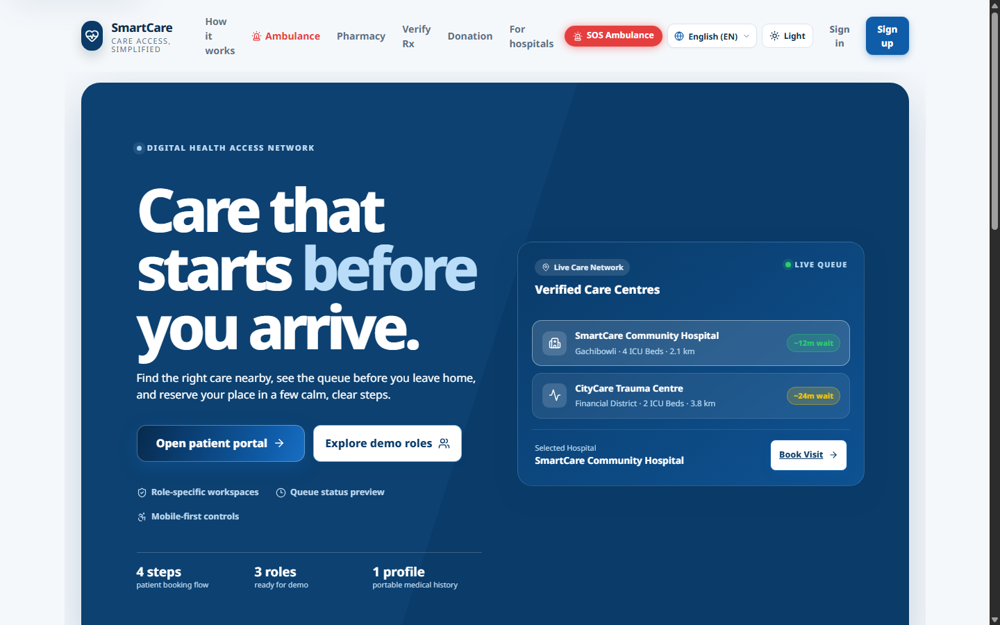
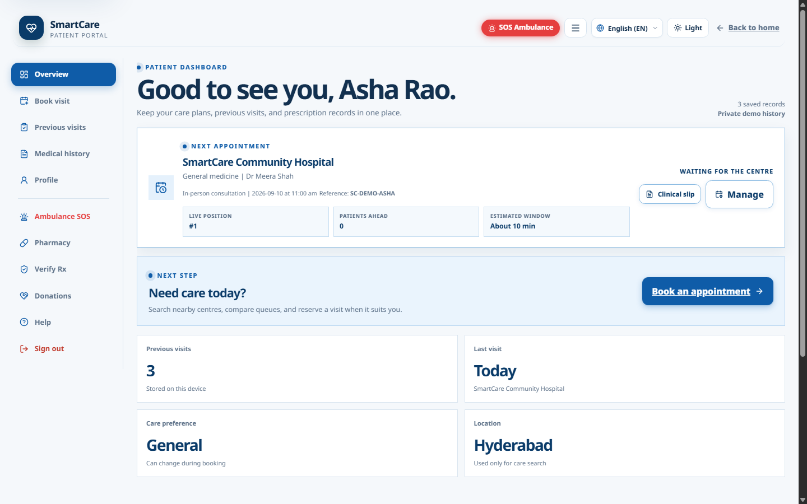
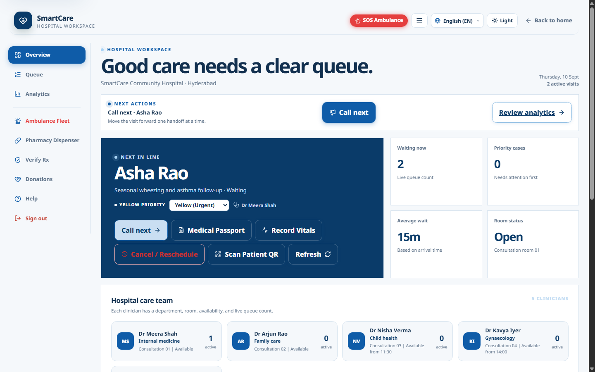
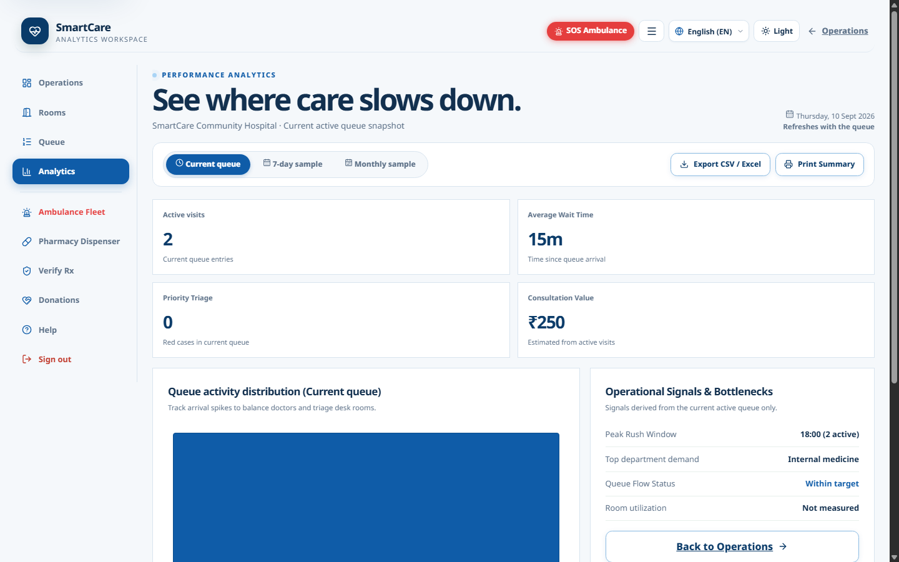
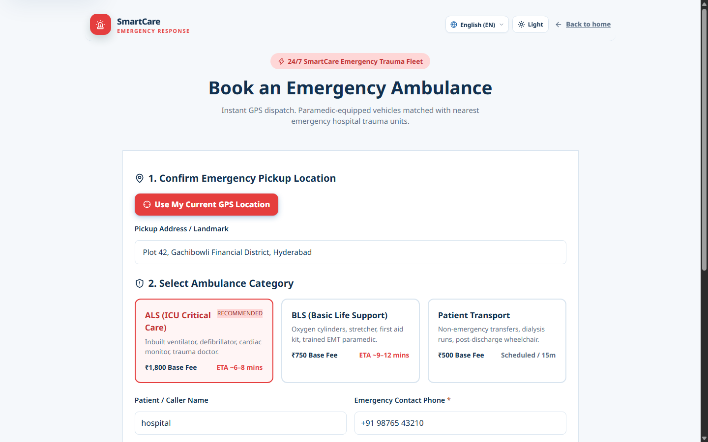
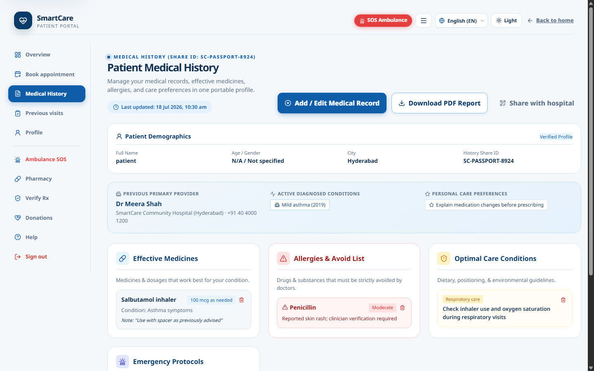
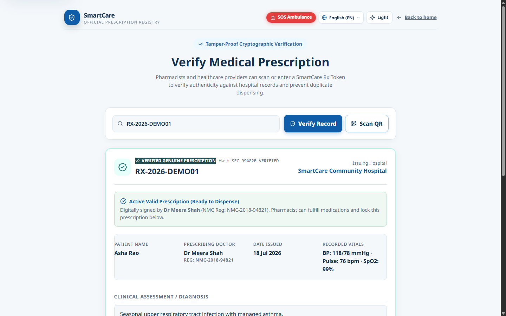
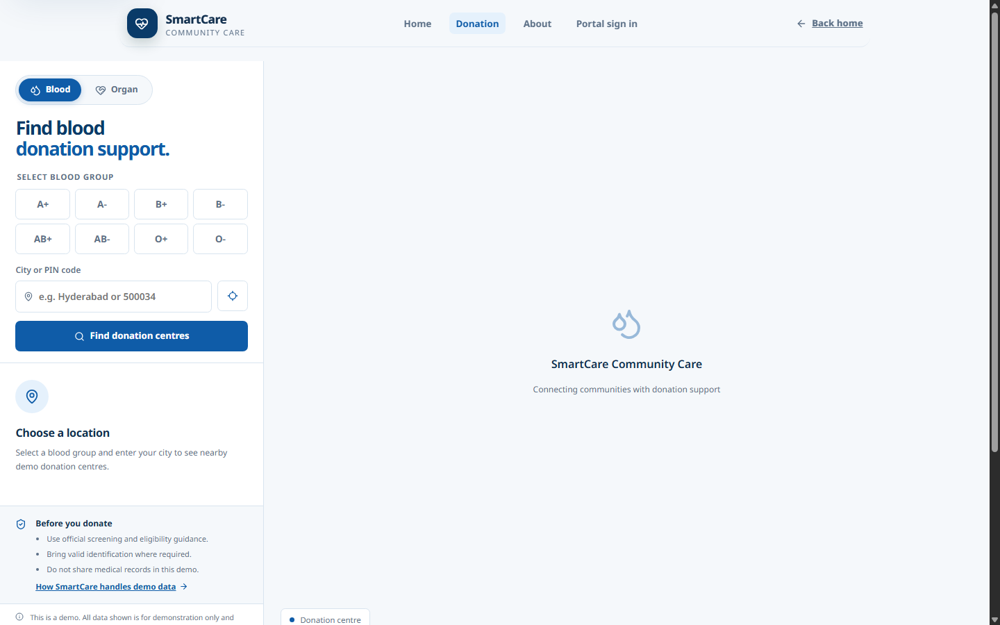

# 🏥 SmartCare — Next-Gen Hospital & Healthcare Operating System

**SmartCare** is an integrated, modular digital health platform engineered to streamline clinical workflows, eliminate patient wait queues, connect emergency ambulance dispatch, and empower healthcare professionals and patients with unified health data.


---

## 🚀 Key Modules & Capabilities

SmartCare is architected around dedicated, role-specific workspaces and critical emergency systems:

### 1. 👤 Patient Care & Portal
- **Smart Appointment Booking**: Real-time doctor availability and intelligent time-slot selection.
- **Live Queue Monitoring**: Live tracking of queue tokens with estimated wait times to eliminate crowded waiting rooms.
- **Portable Medical Passport**: Unified health record storage supporting India's **ABHA** (Ayushman Bharat Health Account) guidelines for interoperable records.

### 2. 🩺 Doctor Workspace & Clinical Station
- **Queue Management**: Direct view of waiting patients with triage tags.
- **Consultation & EHR**: Digital diagnosis recording, prescription generation, and allergy alerts.
- **Verification Ready**: Built for verification against the **ABDM HPR** (Healthcare Professional Registry) API.

### 3. 📊 Hospital Operations & Live Analytics
- **Bed & Ward Management**: Real-time monitoring of ICU, general, and emergency bed capacities.
- **Departmental Analytics**: Patient influx, discharge rates, pharmacy metrics, and revenue analytics.

### 4. 🚑 Emergency & Ambulance Dispatch
- **GPS Dispatch**: Real-time dispatching and routing for critical emergency response.
- **Triage Synchronization**: Real-time transmission of patient vitals directly from the ambulance to the emergency room.

### 5. 🩸 Blood Donor Network & Pharmacy Verification
- **Donor Network**: Searchable database matching blood groups and donor locations for urgent transfusions.
- **Pharmacy Verification**: Barcode/QR verification to prevent fraudulent prescriptions and manage stock levels.

---

## 📸 Screenshots & UI Showcase

| Module | Preview |
| :--- | :--- |
| **Landing Page** |  |
| **Patient Dashboard** |  |
| **Doctor Workspace** |  |
| **Hospital Analytics** |  |
| **Ambulance Dispatch** |  |
| **Medical Passport** |  |
| **Pharmacy Verification** |  |
| **Donor Network** |  |

---

## 🏛️ Architecture & Tech Stack

- **Build Tool & Dev Server**: [Vite 5](https://vitejs.dev/) for sub-millisecond HMR and optimized production bundles.
- **Frontend Core**: Vanilla JavaScript with native ES Modules (`js/`) for maximum performance without framework overhead.
- **Styling**: Modular CSS design tokens (`css/`) adhering to accessible healthcare visual standards.
- **Standards Alignment**: Architected for **ABDM** (Ayushman Bharat Digital Mission) compliance and **FHIR** standards.
- **Deployment**: Zero-configuration deployment with [Vercel](https://vercel.com/) (`vercel.json`).

---

## 📂 Directory Layout

```text
smart-care-app/
├── index.html              # Main application entry point
├── 404.html                # Custom 404 error page
├── vite.config.js          # Vite build and server configuration
├── vercel.json             # Vercel deployment routing rules
├── package.json            # Project scripts and dependencies
├── cando.md                # Comprehensive feature roadmap & specifications
├── techstack-shift.md      # Architecture rationales & tech decisions
├── css/                    # Modular stylesheets and design tokens
├── js/                     # Application logic, state management & API services
├── screenshots/            # UI screenshots and visual walkthroughs
└── scripts/                # Utility and linting scripts
```

---

## 🛠️ Getting Started

### 1. Prerequisites
- **Node.js** (v18.0.0 or higher recommended)
- **npm** or **yarn** / **pnpm**

### 2. Installation
Clone the repository and install dependencies:
```bash
git clone https://github.com/Mohammed-Ashraf-Shaik/smart-care-app.git
cd smart-care-app
npm install
```

### 3. Running the Development Server
Start the local development server:
```bash
npm run dev
```
Open your browser and navigate to `http://localhost:5173`.

### 4. Building for Production
```bash
npm run build
```
To test the production build locally:
```bash
npm run preview
```

---

## 🗺️ Roadmap

- [x] Responsive Role-Based Dashboards (Patient, Doctor, Admin)
- [x] Appointment booking & live queue tokens
- [x] Ambulance dispatch & donor network UI
- [ ] Integration with ABDM Sandbox (ABHA creation & HPR validation)
- [ ] Automated SMS & WhatsApp status notifications
- [ ] WebRTC-based telemedicine video consultations

---

## 👤 Author

**Mohammad Ashraf Shaik**
- GitHub: [@Mohammed-Ashraf-Shaik](https://github.com/Mohammed-Ashraf-Shaik)
- LeetCode: [Shaik_mohameed_Ashraf](https://leetcode.com/u/Shaik_mohameed_Ashraf)
- Chess.com: [ashumm](https://www.chess.com/member/ashumm)
